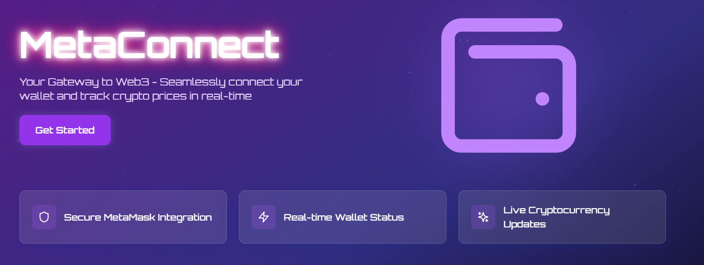
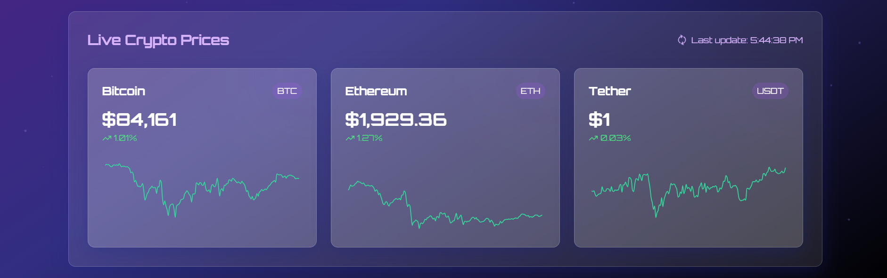
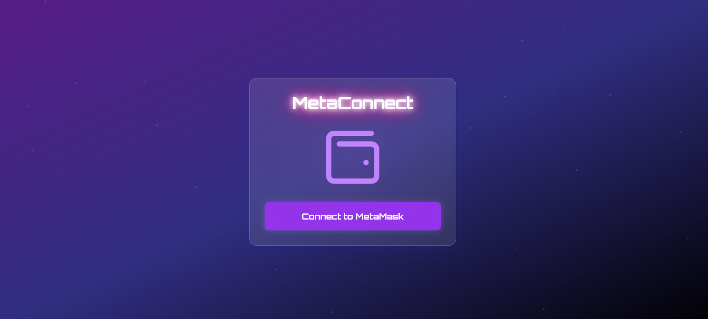

# MetaConnect

### MetaMask Wallet Connection with React and Web3

This project is a React-based application that allows users to connect their MetaMask wallet. Using the Web3 library, it fetches the user’s wallet address and displays it in a styled interface. The project includes a “Connect to MetaMask” button and allows users to disconnect their wallet when connected.





## Features

1. MetaMask Wallet Connection: Easily connect and disconnect MetaMask wallets.
2. Web3 Integration: Utilizes Web3.js to interact with Ethereum wallets.
3. Responsive and Animated UI: The application is styled with Tailwind CSS for smooth transitions, animations, and a polished appearance.
4. React State Management: Manages connection state using React's useState.

## Prerequisites

1. MetaMask: Users should have MetaMask installed in their browser.
2. Node.js and npm: Ensure you have Node.js installed along with npm.

## Dependencies

1. React: Frontend framework
2. Web3.js: For MetaMask integration
3. Tailwind CSS: For styling and responsiveness

## Key Code Snippets

1. Connecting to MetaMask

- This function uses Web3 to request accounts from MetaMask and update the app's state with the wallet address:

```
const connectWallet = async () => {
  if (window.ethereum.isMetaMask) {
    const web3Provider = new Web3(window.ethereum);
    const accounts = await web3Provider.eth.requestAccounts();
    setAccount(accounts);
  }
};

```

## Disconnecting Wallet

This function simply resets the state to disconnect the wallet:

```
const disconnectWallet = () => {
  setAccount(null);
};

```

## Acknowledgments

1. [MetaMask Documentation](https://docs.metamask.io/wallet/)
2. [Web3.js Documentation](https://docs.web3js.org/)
3. [React](https://vite.dev/guide/)
